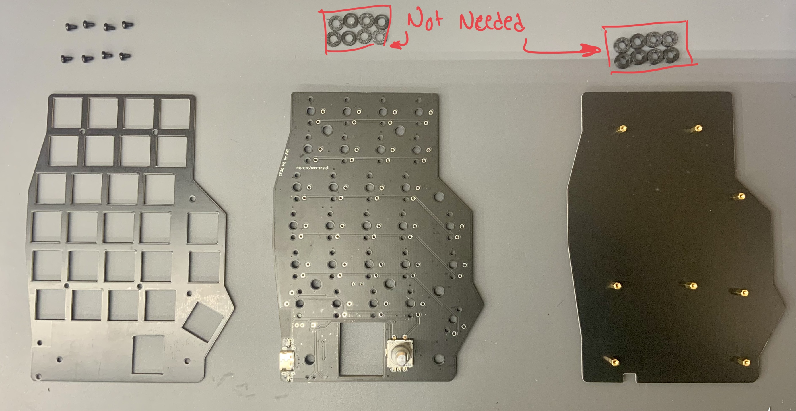
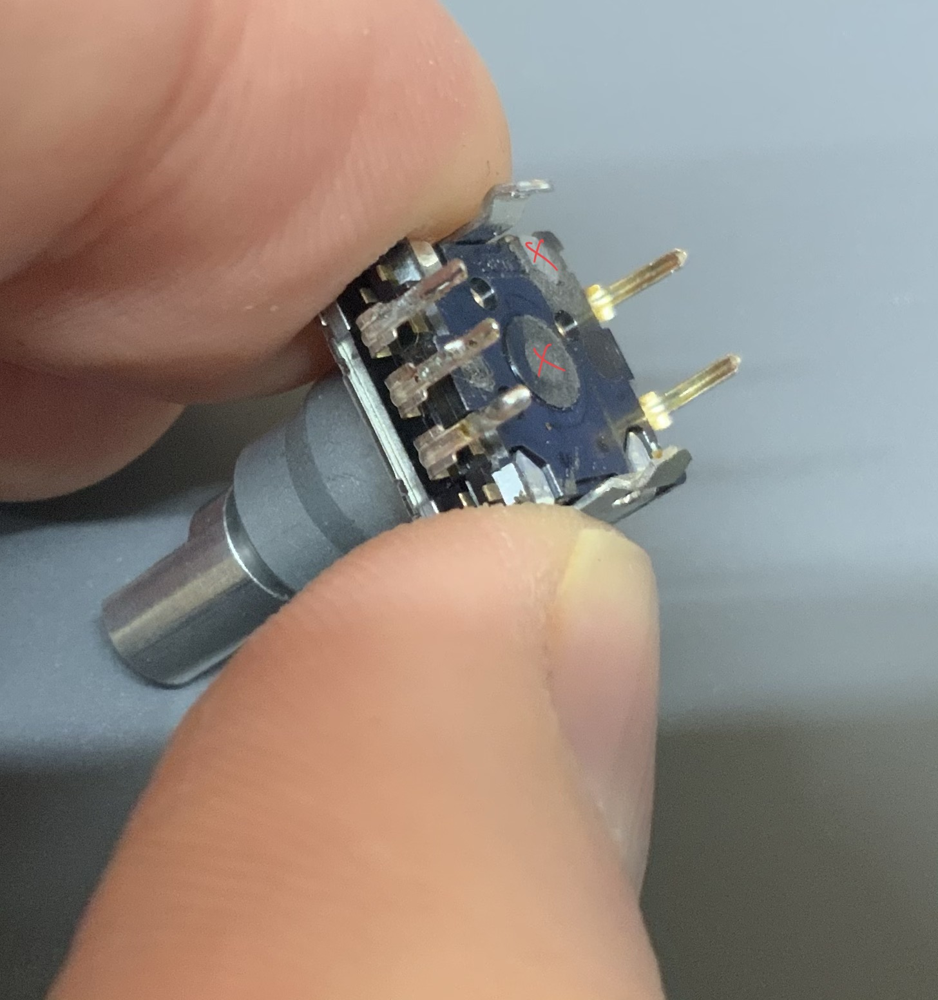
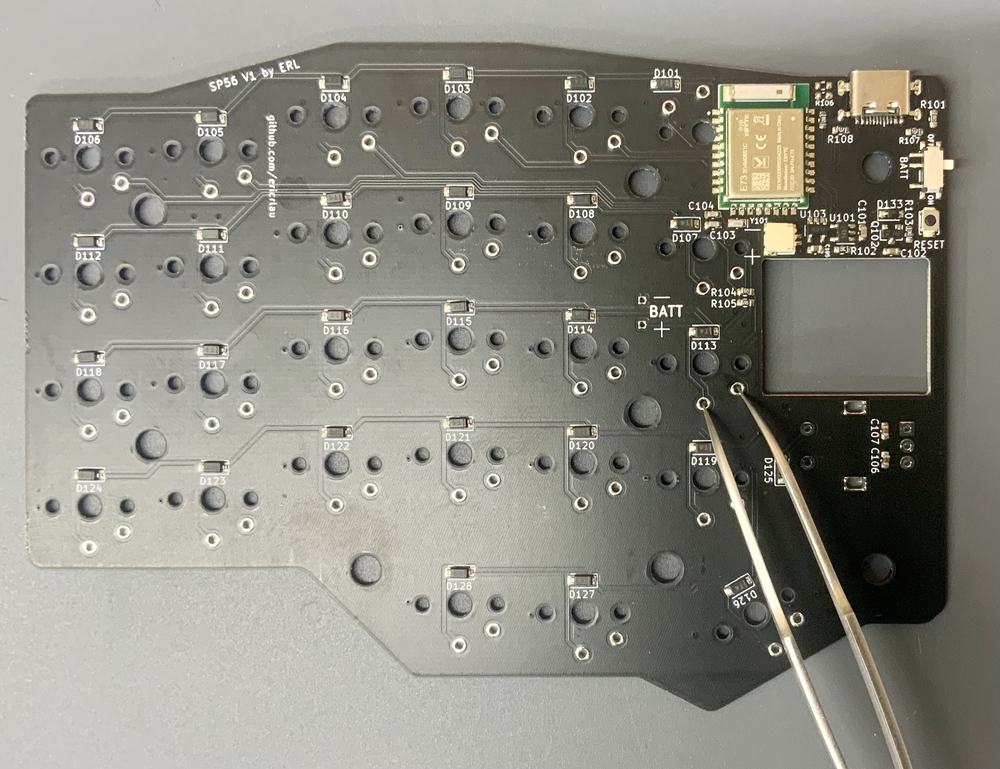
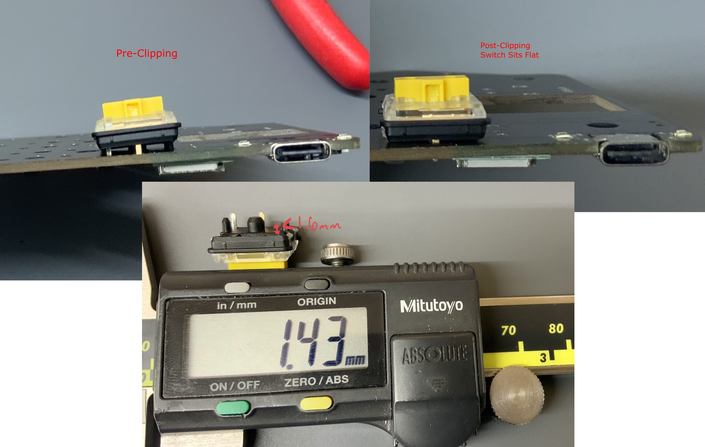
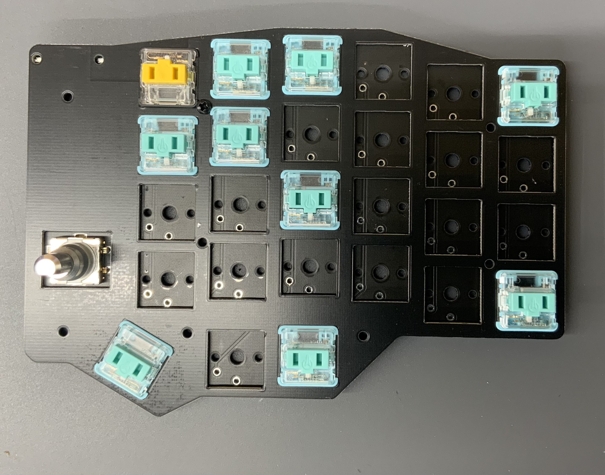
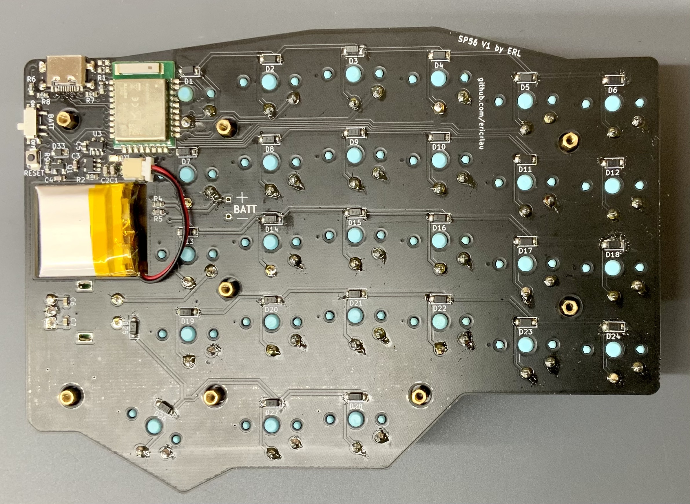
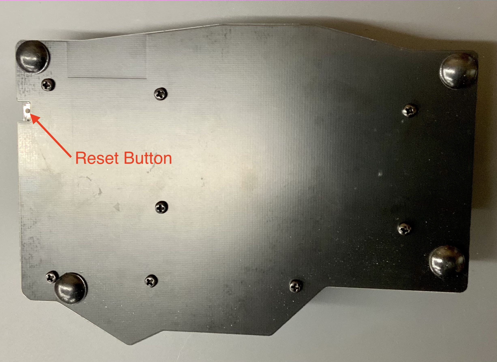
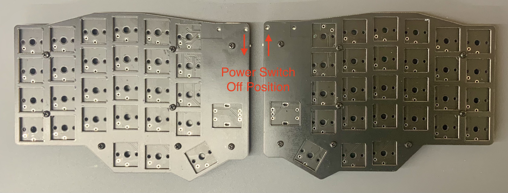

# SP56
## Build Guide (From PCBA)

> :Warning: **This is a partially tested project.** Do not use to create your own copy unless you are willing to debug the hardware and/or firmware. 

---
## What You'll Need
* Kaihl Choc V1 Switches - QTY 54 
* 1U Keycaps - QTY 52
* 1.5U Keycaps - QTY 2
* EC11 Encoders with Knobs - QTY 2
* Li Ion Batteries, less than 20x24x6mm - QTY 2
* Soldering Tools

---

## Unpack From Shipping
* Remove the 8 M2 screws from the top side (switch plate). 

* You will see 8 1MM plastic spacers and 8 3MM thick plastic spacers, these are just for shipping and should be removed. 

## Install Encoder
The SP56 is compatible with EC11 style encoders. You will need 2 encoders and 2 knobs. Install the EC11 style encoder and solder pins. 
* NOTE: If your encoder has plastic locating nubs on the bottom these should be removed to allow encoder to sit flush. 
* Note 2: As of 31 Mar 2021, ZMK firmware does not support encoder functionality on the peripheral (right) side. The right side encoder push switch will be functional but rotating the knob will not. 
* 

## Plug In and Test via USB
* Before shipping any PCBAs I have flashed default firmware and checked function of all switch positions and encoders; however, it is still a good idea to plug in both PCBs to USB (left board should be connected to USB on your computer, right just needs power so you could use a usb charger) and testing again over USB since it is a lot harder to troubleshoot once the switches are soldered in. Pull up your favorite keyboard testing website and check that left encoder is working and all switch positions work if you short across the two through hole pins with a tweezers. 

## Install Switches
The SP56 is compatible with Kaihl Choc V1 switches only. You will need 54 switches in total. 
* Trim 2 switches: On each side, the top inner switch will need to have one of the plastic legs trimmed to a length of 1.6MM or less since the wireless module is directly underneath the switch length. 

* Install First switches into plate: Start by snapping in a few switches to the switch plate to hold the plate while you snap in the remaining switches. 

* Make sure that all switches are snapped into the plate, switches are sitting flat against main pcb and all metal switch legs are in the through-holes on the main PCB. 
* Solder in switches.
* Install keycaps.

## Install Batteries
* If using wirelessly, you will need to install batteries in each side of the board. There is a JST SH connector on the board that you can use, or if you prefer, you can solder to through holes. The battery opening is 24X20MM and is designed around 150mAh batteries from https://tinycircuits.com/collections/batteries/products/lithium-ion-polymer-battery-3-7v-150mah . Other similar size batteries should also work fine. 
* NOTE: there is no standard for battery polarity on batteries that you buy with a connector preinstalled on them. You must confirm that your positive battery wire is connected to the + side of the connector, as marked on silkscreen. 

## Install Hex Standoffs And Bottom Cover
* Once all the switches are soldered you can install the hex standoffs and bottom cover again. There is very little clearance for the screw heads on the switch plate side but they should fit. 

## Use
* See ZMK docs for information about firmware customization, flashing, and troubleshooting. 
    * https://zmkfirmware.dev/docs/user-setup/
	* https://zmkfirmware.dev/docs/customization 
* See COBO ZMK Config repo for default firmware
    * https://github.com/ericrlau/COBO-zmk-config
* To put into bootloader mode press the reset button 2 times quickly. You should see a solid blue LED when in bootloader mode. 

* Charging of the Li Ion battery is controlled by an onboard charger. When charging via USB you should see a solid red LED. Once charging is complete the red LED will turn off. 
* There is a power switch on each side. Since the boards are mirrored the off position for the two sides are opposite. Turning the switch off will prevent battery power to the nrf52840 but it will still allow charging and the nrf52840 will still be powered by USB (if plugged in).

