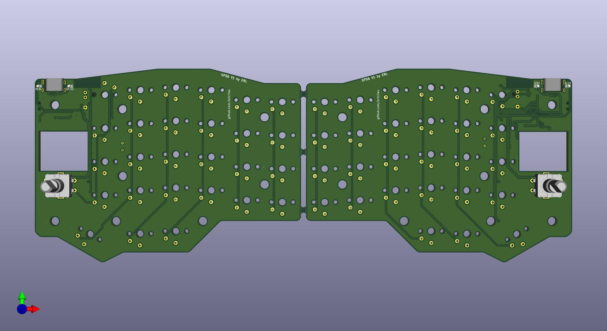
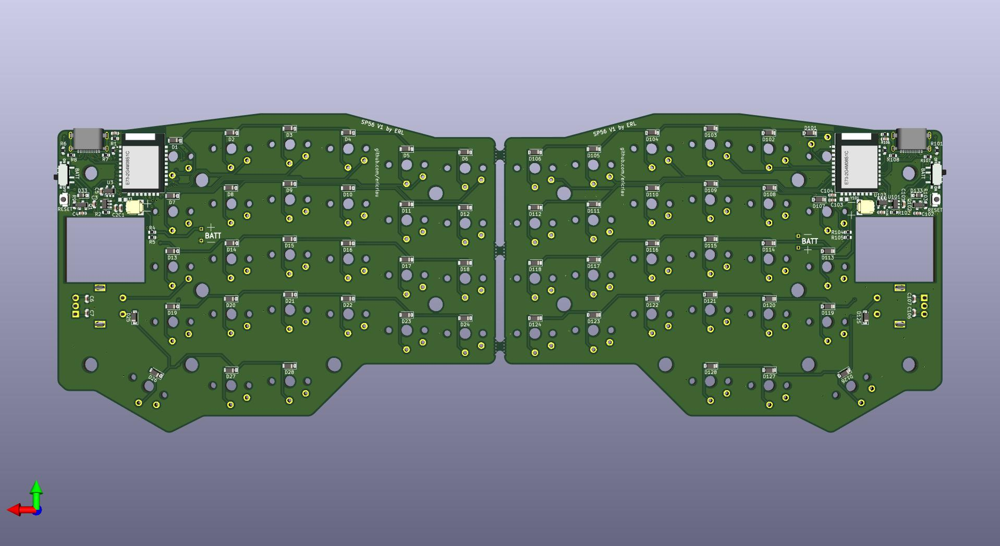
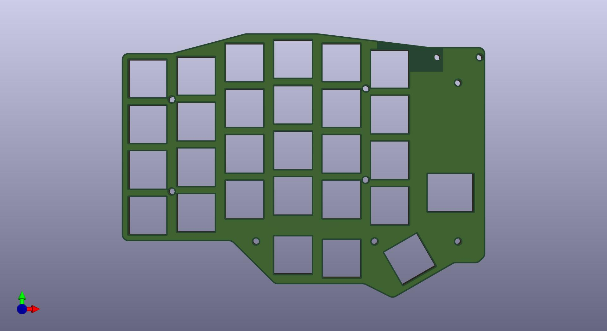
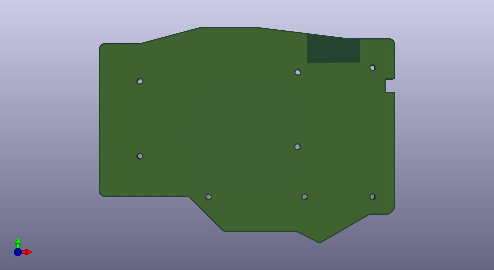

# SP56
## A ZMK-Powered BLE Keyboard, Inspired By Lily58 & Sofle

> :warning: **This is an untested project.** Do not use to create your own copy unless you are willing to debug the hardware and/or firmware. 
## Flash bootloader
Bootloader is pre-loaded on assembled pcbs. If you source your own BLE module you will need to unlock the module and flash the bootloader using the Nordic nrf command line tool. 
```
$ nrfjprog --recover --log 
```
```
$ nrfjprog -f nrf52 --program firmware/bootloader/COBO_nrf52840_bootloader-0.3.2-184-g64ea299_s140_6.1.1.hex
```

------------------------------------
## Upload Firmware 

- See ZMK docs for instructions on setting up ZMK and custimizing firmware.  
	* https://zmkfirmware.dev/docs/user-setup/
	* https://zmkfirmware.dev/docs/customization 
- Default *.uf2 files are pre-loaded on assembled pcbs. If you sourced and assembled your own pcb, you can file deafult pre-built firmware here: 
	- https://github.com/ericrlau/COBO-zmk-config/releases

## PCB
- Source files for pcb are in this repo. They are split into three kicad projects:
	- SP56: main pcb, left and right combined. 
	- SP56_Bottom: Bottom cover PCB. Left and right use the same part so only one copy is created. 
	- SP56_Plate: Switch plate PCB. This must be 1.2mm pcb to allow Kaihl Choc V1 switches to snap in. Left and right use the same part so only one copy is created. 
	- NOTE: KiCad files are created with nightly KiCad 5.99 builds, they are not compatible with current stable release of KiCad 5.
- Bill of materials [Link](https://raw.githack.com/ericrlau/SP56/working/PCB/SP56/bom/ibom.html)
## ToDo 
- Test prototypes. 
- adjust power switch pins on one side so that the switch on positions aren't mirrored on left and right. 


## Images

#### Prototype Build

#### Main PCB



#### FR4 Plate


#### Bottom PCB



